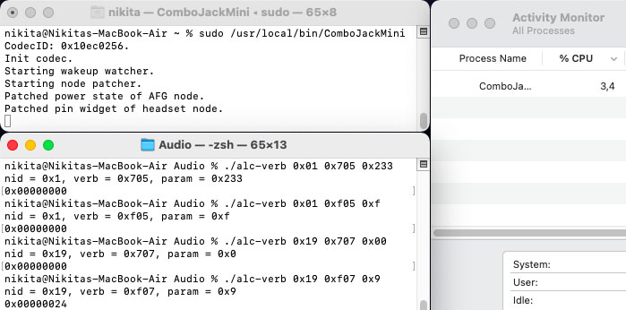

# ComboJackMini

Hackintosh ComboJack "dynamic node patching" for almost any codecs, that has 0x19|0x01 node as a headset|AFG node.

**Tested on ALC256 and macOS from 10.15.7 to 26.0 DP6**

## Which problems does it fix?

- After sleep, when connecting headphones, there will be no sound.
- When after some time with unplugged AC adapter or after booting into macOS with no AC adapter connected, from headphones will be coming noise, or sound will be distorted.
- Sound on speakers randomly disappears.
- Almost any other problems, that depending on the 0x19 headset node and 0x01 AFG node.

**Installation note**

-  Add boot-arg `alcverbs=1` or DeviceProperties to PciRoot(Address of codec) `alc-verbs | Number | 1`. Otherwise, daemon will not work at all.

**Building**

- Run Source/Build.command but before, `chmod +x` it.

**Cons**

- Eats CPU resources a bit (1-4%) due to polling mode.
- When `AFGpatcher(void)` is triggered, slight pop or click can be heard.

Credits
-----

- [hackintosh-stuff](https://github.com/hackintosh-stuff) for creating [ComboJack](https://github.com/hackintosh-stuff/ComboJack)
- [vit9696](https://github.com/vit9696) for [AppleALC](https://github.com/acidanthera/AppleALC)
- [mbarbierato](https://github.com/mbarbierato) for developing
- [Lorys89](https://github.com/Lorys89) for setting alc verbs and add codec support
- [nikich768](https://github.com/nikich768) for writing a patcher function
