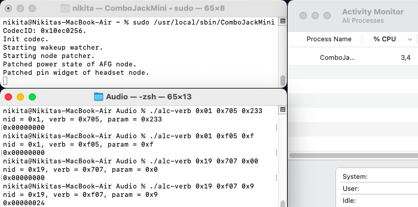

# ComboJackMini

Hackintosh ComboJack dynamic node patching for **|ALC236|ALC255|ALC256|ALC289|ALC295|** and others.

**This fork does not show any pop-up and not have headphone/headset mode, cause it's automatic. It just watches pin widget of 0x19 and power state of 0x01 node and if macOS changes it to something another, daemon immediately reverts it back.**

## What problems does it fix?

- After sleep, when connecting headphones, there will be no sound.
- When after some time with unplugged AC adapter or after booting into macOS with no AC adapter connected, from headphones will be coming noise, or sound will be distorted.
- Sound on speakers randomly disappears.
- Almost any other problems, that depending on the 0x19 headset node and 0x01 AFG node.

 **Installation/Uninstallation**

-  **Disable SIP**
-  Add boot-arg `alcverbs=1` or DeviceProperties to PciRoot(Address of codec) `alc-verbs | Number | 1`
-  For install run Installer/Install.command.
-  For uninstall run Installer/Uninstall.command.
-  Enable SIP

 **Building**

- Run Source/Build.command.

 **Cons**

- Eats CPU resources a bit (1-4%) due to polling mode.
- When AFGpatcher() is triggered, slight pop or click can be heard.

Credits
-----

- [hackintosh-stuff](https://github.com/hackintosh-stuff) for creating [ComboJack](https://github.com/hackintosh-stuff/ComboJack)
- [vit9696](https://github.com/vit9696) for [AppleALC](https://github.com/acidanthera/AppleALC)
- [mbarbierato](https://github.com/mbarbierato) for developing
- [Lorys89](https://github.com/Lorys89) for setting alc verbs and add codec support
- [nikich768](https://github.com/nikich768) for writing a patcher function
