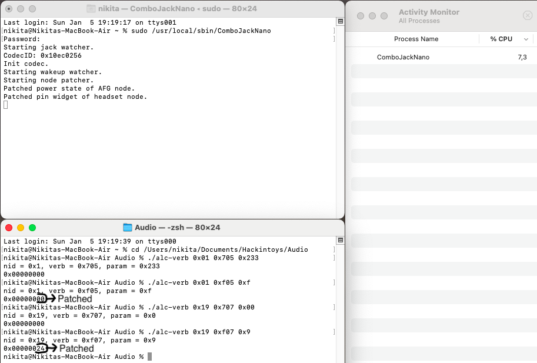

# ComboJackNano

Hackintosh combo-jack dynamic patching for **|ALC236| |ALC256| |ALC289| |ALC295|** and maybe others.

**This fork does not show any pop-up and not support headphone/headset mode(cause it's automatic). It just watches pin widget of 0x19 and power state of 0x01 node and if macOS changes it to something another than 0x24 on 0x19 and 0x00 on 0x01, daemon immediately reverts it back.**

## What problems does it fix?

- After sleep, when connecting headphones, there will be no sound.
- When after some time with unplugged AC adapter or after booting into macOS with no AC adapter connected, from headphones will be coming noise, or sound will be distorted.
- When using manual layout (where int. speakers, headphones, inputs are separated, and no automatic switching) after sleep, using inputs or outputs separately will be broken. For example, after using int. speaker and then switching to headphones and vice versa, after some time(by default 30s) sound will disappear, or when using int. speaker and HP jack simultaneously, and if any input device will be used, then again, after 30s of not using this device audio disappear both on int. speaker and HP jack.
- Almost any other problems, that depending on the 0x19 headset node and 0x01 AFG node.

## Installation/Uninstallation

-  Add boot-arg `alcverbs=1` or DeviceProperties to PciRoot(Address of codec) `alc-verbs | Number | 1`
-  For install run Installer/Install.command from terminal or with two clicks from Finder.
-  For uninstall run Installer/Uninstall.command from terminal or with two clicks from Finder.

## Building

- Run Source/Build.command from terminal or with two clicks from Finder.

## Semi-problems

- Even though it's a ComboJack**Nano** you will have a 2-8%(depends on how this daemon is loaded, if loaded through launchctl then it can vary, if directly from terminal then it will be almost static 7-8%) of CPU load(at 1 core) on something like i5-1035G1 because of polling mode. Load can be reduced by increasing **usleep(3000);** parameter in Source/Combo Jack/hda-verb.m, but a higher value increases the likelihood of encountering the second issue.
- When **AFGpatcher()** is triggered, and while it triggered you playing an audio, you may hear a slight pop or short(or longer, depending on the **usleep(3000);** value)-term faded disappearing of sound. More noticeable on headphones, on internal speakers barely noticeable, but I think it may depend on the codec/its sub-vendor and amp between codec and speakers/HP jack.

Credits
-----

- [hackintosh-stuff](https://github.com/hackintosh-stuff) for creating [ComboJack](https://github.com/hackintosh-stuff/ComboJack)
- [vit9696](https://github.com/vit9696) for [AppleALC](https://github.com/acidanthera/AppleALC)
- [mbarbierato](https://github.com/mbarbierato) for developing
- [Lorys89](https://github.com/Lorys89) for setting alc verbs and add codec support
- [nikich768](https://github.com/nikich768) for writing a patcher function
